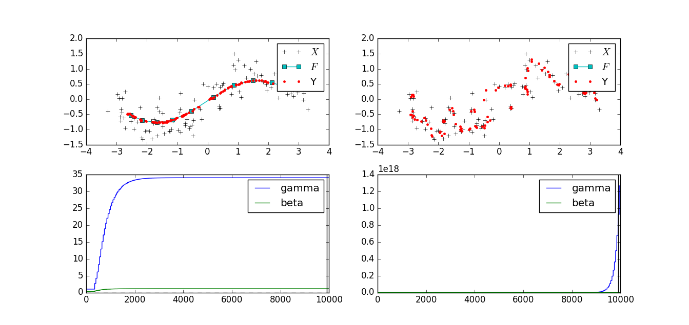
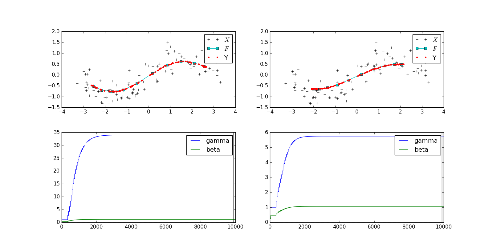

# 検証内容
428と524を比較．
## 検証結果

- 428は$\gamma$もちゃんと収束，かつきれいにフィッティング
- 524はゼロ割が発生．
## 検証その2
524を428と対応取るために$\gamma := \gamma/D$としてみる

- 524はアンダー気味だが安定はしている．
## 検証その3
データにノイズが0の場合…$\gamma$は両方共大きくなり続ける．（数式上も解が存在しないため予想通りの結果）
