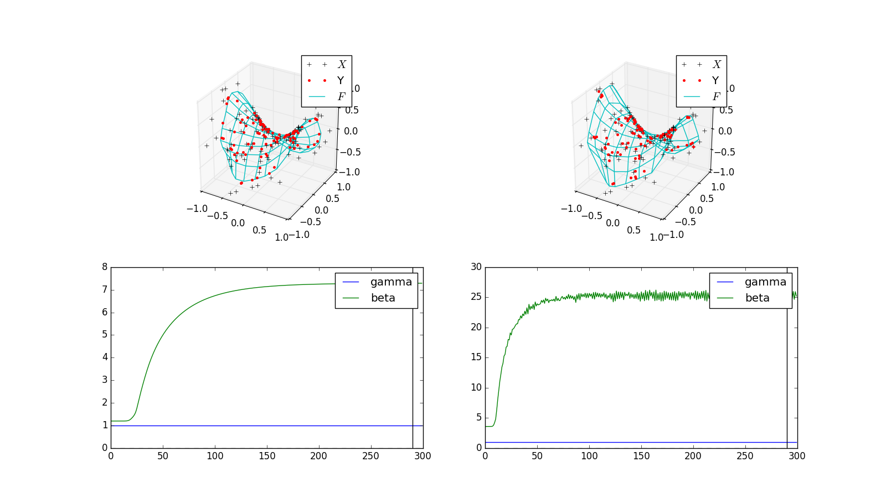

# 検証内容
331とstandard版の比較
2者の相違点は$\beta_0$の定義．後者はDも考慮している．
# 検証結果

- standard版は$\beta_0$を大きめに見積もり，なおかつ振動する様子
- 写像も$\beta_0$の振動に合わせて振動する．
# 未検証
- $\alpha$と$\gamma$の変更．  
  - 331では後者を1.0として固定しているがstandard版では前者を1.0と固定する
  - この場合は潜在変数の初期値の範囲に注意が必要．$\gamma$に比べて十分小さくする必要があるため，standard版ではかなり小さい値にしないと学習がうまくいかない
