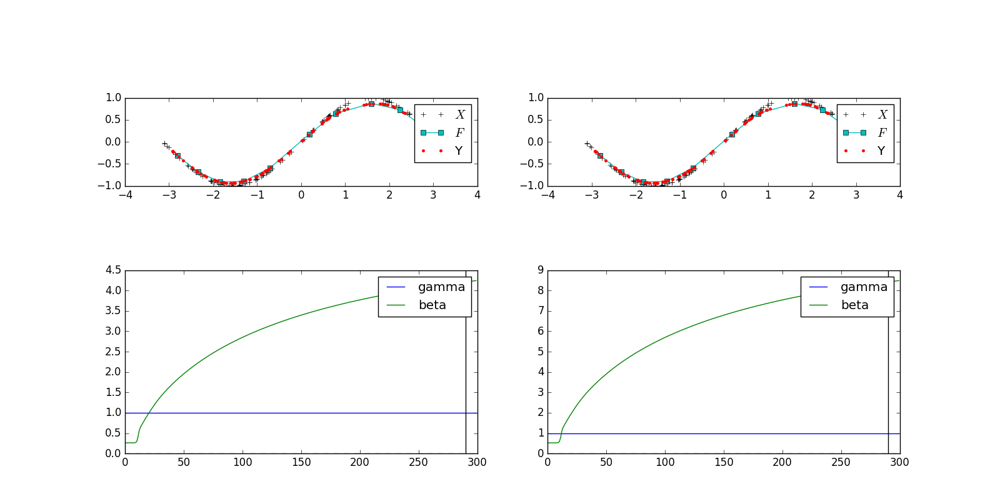

# 検証内容
331とstandard版の比較
2者の相違点は$\beta_0$の定義．後者はDも考慮している．
# 検証結果
- standard版は$\beta_0$が振動する
---
# 検証内容その2
331とstandardの対応を取る．
standardのAをDで割る
# 検証結果

- 対応が取れた
  - $z$に関しては一致
  - 331のbetaとstandardのbeta/2.0が一致（D=2より）
---
# 検証内容その2  
- standardの$\alpha$を$D$倍
- $\varepsilon$を$D$で割る
# 検証結果
- 331と$z$がtrue
---
# 未検証
- $\alpha$と$\gamma$の変更．  
  - 331では後者を1.0として固定しているがstandard版では前者を1.0と固定する
  - この場合は潜在変数の初期値の範囲に注意が必要．$\gamma$に比べて十分小さくする必要があるため，standard版ではかなり小さい値にしないと学習がうまくいかない
