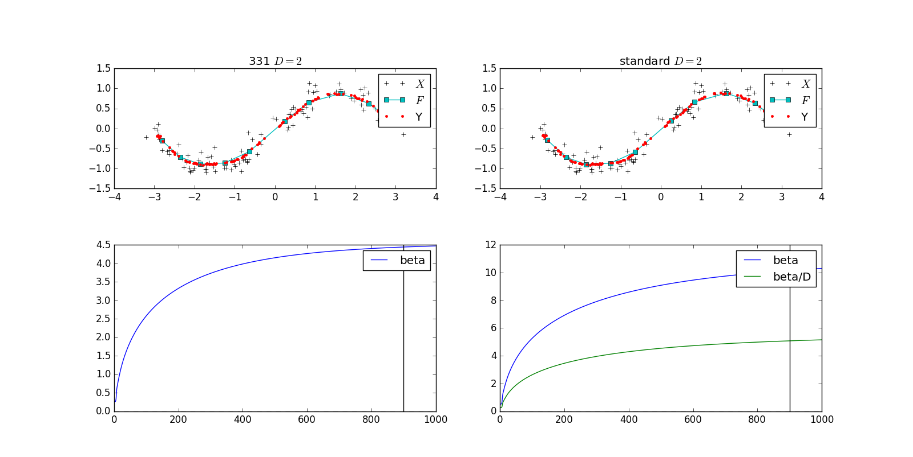
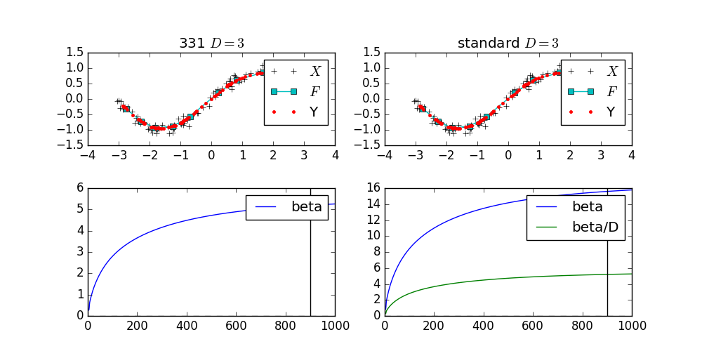
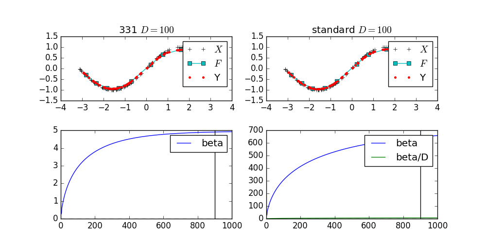

# 検証内容
- standardが$D$を大きくしても安定して$\beta_0$を推定できるか検証
  - 331と比較．
    - 331と対応を取るために，331の方の$\alpha$を入力データの次元に合わせて$\alpha=\alpha/D$と外部から指定
  - 入力のノイズの分散は$\sigma/D$とする
    - 各次元同じノイズが乗っていたら足し合わされていくためデータ次元$D$で割ると常に同じノイズと見なせるはず．
# 結果
- $D=2$

- $D=3$

- $D=5$

- $D=10$

- $D=100$

